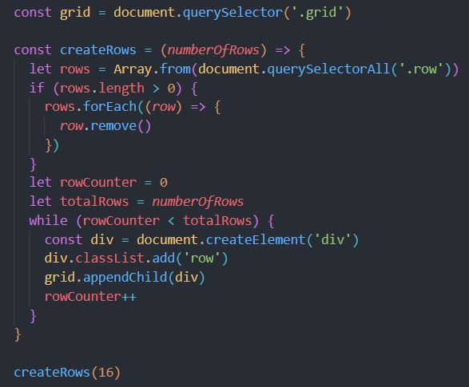
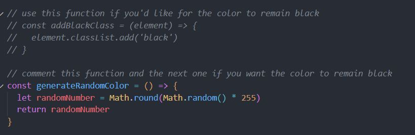
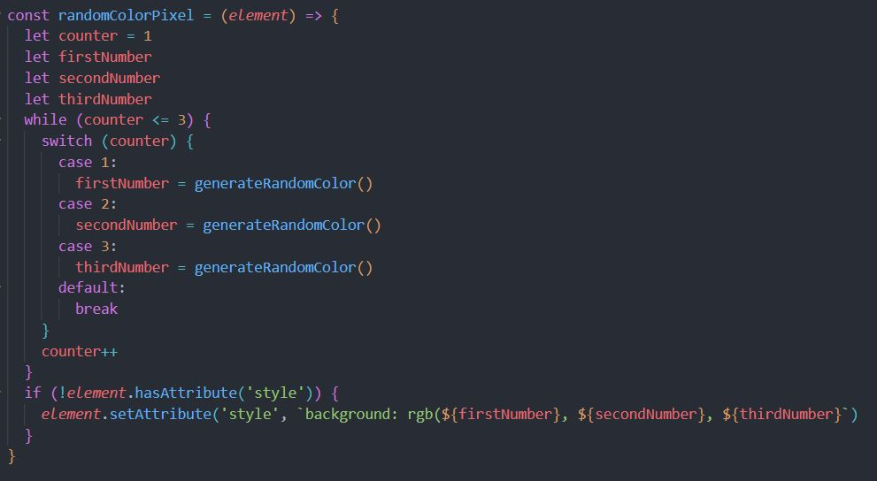
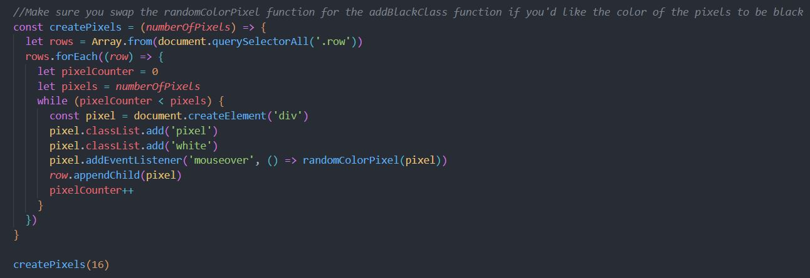
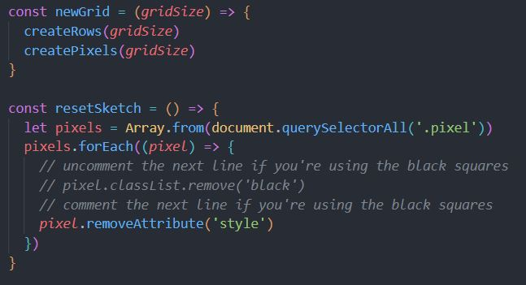

# Etch-a-Sketch

Odin-Etch-a-Sketch project to keep practising DOM manipulation

# What the project is about

This project is a follow-up to the Rock-Paper-Scissors project to keep practising DOM manipulation.

The original objective is to create a default 16X16 grid of squares that get black as you hover your mouse over each one of them.

As you may notice, the squares are not painted black as I decided to go for the extra credit task and randomise the colours.

However, if you wish to check the original objective, the code explanation section will explain how you can achieve so.

# What have I learned so far?

In this project I started implementing the basics of DOM manipulation to make an interactive website.
Below you can read what new concepts I implemented during this project.

<ul>
  <li>Creation, modification and deletion of DOM elements.</li>
  <li>Implementation of event handlers to interact with user. </li>
  <li>Use of functions to randomise some values.</li>
</ul>

# Want to see it in action?

<a href="https://hroglardev.github.io/Etch-a-Sketch/" target="_blank">Click here</a>

# Explanation of the code

The code initilises by saving the DOM element which contains the grid into a constant.

After this we have a function that first checks if there are elements already in the DOM with the designated class of "row". If there are, then it procedes to delete them. This is done to allow the user to input another grid size through a button should it be wished.

Next, the function enters a loop that executes an "n" amount of times (this is passed to the function as a parameter) and procedes to create one element on each iteration as well as assigning it the appropiate class and appending it to the according parent node.

Finally, the function is called with a number of 16 as the default initial value.

In this section you'll see a comment that contains a function. This function handles the case that you want to paint each square black, instead of random.

After the comments, we find a simple function (which you should comment if you want to use the simpler black version) to generate a random number between 0 and 255. This function will be used to randomise the colors of each square.

The next function (which you should also comment if you want to use the black version of the grid) declares three variables and initialises a loop to get three random numbers through the previous function and assigns the values to each of those variables.

After exiting the loop, the function checks if the element passed as a parameter has the attribute "style" in it. If it doesn't, it adds it and gives it a background with the rgb numbers saved in the variables.

The next function works very similar to the first function in the code but it uses the previously generated rows to append the appropiate number of elements to each row.

The function iterates through the rows previously generated and on each iteration it creates a number of squares (through the loop) that are passed as a parameter to the function.

The function also adds an event to each of the squares to be executed when the mouse passes over each one of them.

The random color generator function is executed here and we pass each square as a parameter on each iteration.

Finally the function is called with a value of 16 as a default initial value.

After this we have a simple function that takes a number as a parameter and then calls our rows and squares functions with that value. This function is used when the user inputs another grid size.

The following code is a function to reset the grid to all white squares. It simply iterates through all the elements that have the "pixel" class and for each one of them it removes the style property.

There's a comment inside the function in case you'd like to use the original black version of the squares.

Lastly, we add a click event to the button that executes the previous function to reset the grid.

After this, a last function is declared. This one is executed when another button is clicked (check code below function) and when it happens, the browser opens a prompt that asks the user to input a value for the grid size. A loop is added in case the number is either over 100 or below 4 to reprompt the user.

Once the loop is done, the newGrid function is called with the new size passed as parameter.

Finally we find the event handler for the button who handles the previous function.

# Want to track my progress?

Checkout my other projects in order to see my evolution:

<ol>
  <li><a href="https://github.com/hroglardev/odin-recipes" target="_blank">Recipes</a></li>
  <li><a href="https://github.com/hroglardev/Odin-landing-page" target="_blank">Landing Page</a></li>
  <li><a href="https://github.com/hroglardev/Rock-Paper-Scissors-TOP-Console" target="_blank">Console Rock, Paper, Scissors</a></li>
  <li><a href="https://github.com/hroglardev/Rock-Paper-Scissors-TOP" target="_blank">Rock, Paper, Scissors</a></li>
  <li><a href="https://github.com/hroglardev/Etch-a-Sketch" target="_blank">You are here</a></li>
  <li><a href="https://github.com/hroglardev/Calculator" target="_blank">Calculator</a></li>
  <li><a href="https://github.com/hroglardev/Sign-up-form-TOP" target="_blank">Sign up form</a></li>
  <li><a href="https://github.com/hroglardev/Dashboard" target="_blank">Dashboard</a></li>
  <li><a href="https://github.com/hroglardev/Library" target="_blank">Library</a></li>
  <li><a href="https://github.com/hroglardev/Tic-tac-toe" target="_blank">Tic-tac-toe</a></li>
  <li><a href="https://github.com/hroglardev/Restaurant-page" target="_blank">Restaurant page</a></li>
  <li><a href="https://github.com/hroglardev/To-do-list-js" target="_blank">To-do list</a></li>
  <li><a href="https://github.com/hroglardev/Weather-app" target="_blank">Weather app</a></li>
  <li><a href="https://github.com/hroglardev/Battleship" target="_blank">Battleship</a></li>
  <li><a href="https://github.com/hroglardev/Lucas-Cubile" target="_blank">Portfolio</a></li>
</ol>

These are all my projects in my basic section of my coding journey. I will continue with it in the React section along with back-end programming.

If you'd like to skip my basic projects and jump straight to the next section, you can jump to it in the following link.

<a href="https://github.com/hroglardev/CV-creator" target="_blank">React - Backend</a>
